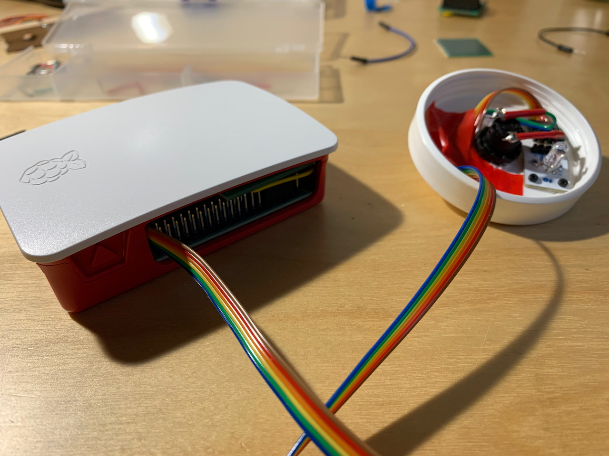
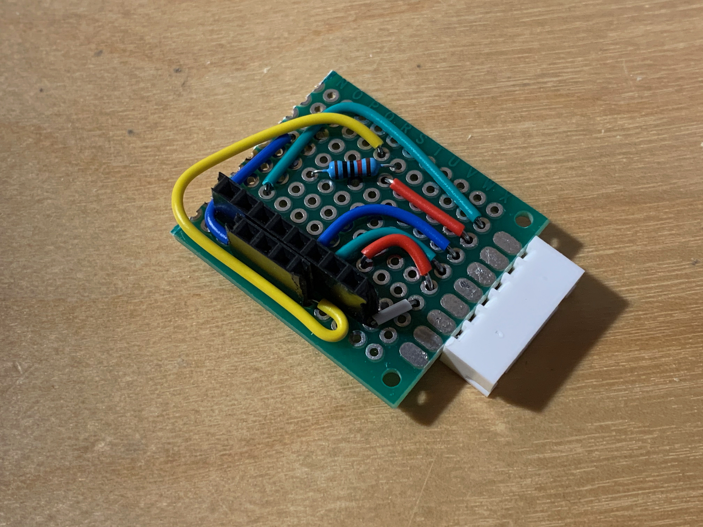

# Raspberry Pi kill switch

This is a project to create a [physical](https://en.wikipedia.org/wiki/Scram) [kill switch](https://en.wikipedia.org/wiki/Kill_switch) for the [Raspberry Pi](https://www.raspberrypi.org/) (Specifically the [Model 3](https://www.raspberrypi.org/products/raspberry-pi-3-model-b/)). It's got a 3-colour LED included to give some status information as it does its job.

## Background

I used a Raspberry Pi along with [shairport-sync](https://github.com/mikebrady/shairport-sync) to play music wirelessly in my living room. However, sometimes I want to turn off the music in a hurry, and I don't know which device (phone, laptop, my wife's phone, etc) is streaming sound to the speaker. This led to the idea of a physical switch connected to the Raspberry Pi which would kill the music immediately.

## The finished product
 

## Materials required
* Raspberry Pi Model 3
* A button
* A cap from a moisturiser jar
* A 3-colour LED module
* Some ribbon cable
* A 200Ω resistor
* Soldering iron
* Small circuit board and connectors

## Assembly Instructions
I started by drilling through the moisturiser jar cap, to have somewhere to mount the button. I previously used one of these for my [water level indicator](https://github.com/skhg/water-filter-sensor) so it was another chance to have a nice plain mount for something. Underneath, i mounted the LED module and soldered the wires to the button terminals. In all, 6 wires are required for the button and the LED module.

The LED module has some built-in resistors so it can be hooked up to a normal 3.3V GPIO pin without any other components required. But the button needs a resistor to ensure we don't blow the circuit if it was pressed too long or shorted. So the next step was to assemble a mini board that will mount on to the Raspberry Pi's GPIO pins.

And the finished board:

 

Once this was put together, it was as easy as connecting the ribbon cable up, and plugging in the power. Here it's installed and everything else tidied away:

## Running the software

## References
https://raspberrypihq.com/use-a-push-button-with-raspberry-pi-gpio/
https://www.electronicwings.com/raspberry-pi/raspberry-pi-gpio-access
https://www.instructables.com/id/Using-a-RPi-to-Control-an-RGB-LED/
