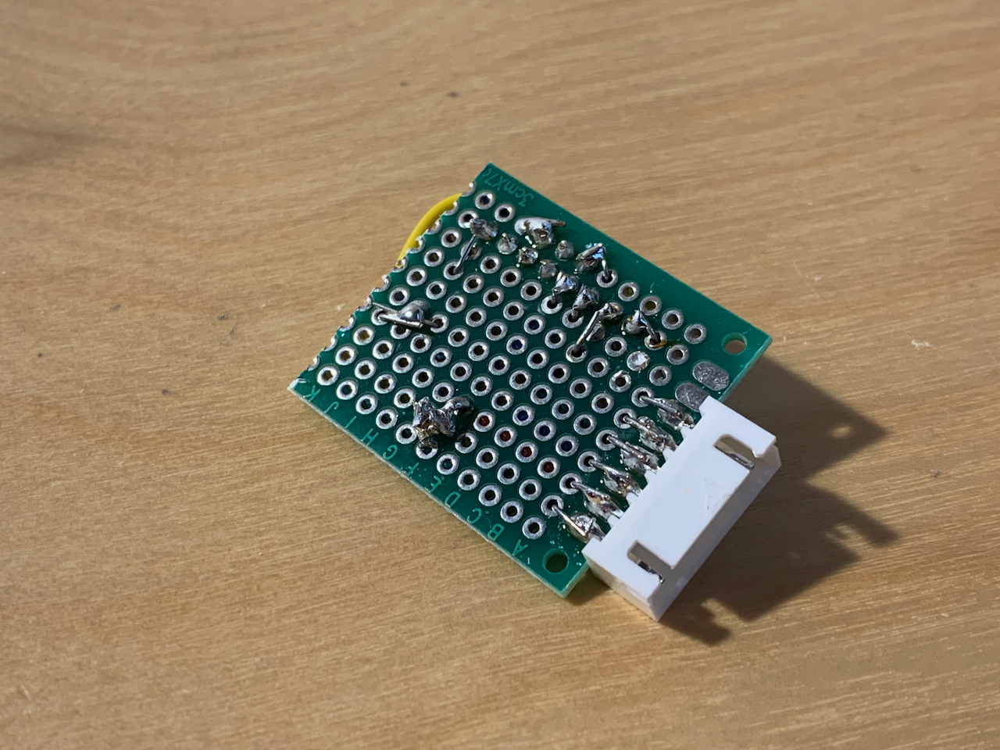

# Raspberry Pi kill switch

This is a project to create a [physical](https://en.wikipedia.org/wiki/Scram) [kill switch](https://en.wikipedia.org/wiki/Kill_switch) for the [Raspberry Pi](https://www.raspberrypi.org/) (Specifically the [Model 3](https://www.raspberrypi.org/products/raspberry-pi-3-model-b/)). It's got a 3-colour LED included to give some status information as it does its job.

## Background

I use a Raspberry Pi along with [shairport-sync](https://github.com/mikebrady/shairport-sync) to play music wirelessly in my living room. However, sometimes I want to turn off the music in a hurry, and I don't know which device (phone, laptop, my wife's phone, etc.) is streaming sound to the speaker. This led to the idea of a physical switch connected to the Raspberry Pi which would kill the music immediately.

## The finished product
 

## Materials required
* [Raspberry Pi Model 3](https://www.raspberrypi.org/products/raspberry-pi-3-model-b/)
* A [button](https://www.amazon.de/dp/B0814N7CH3/ref=sr_1_11?keywords=arduino+taster&qid=1585509555&sr=8-11)
* A cap from a moisturiser jar
* A [3-colour LED module](https://www.amazon.de/dp/B07V6YSGC9/ref=sr_1_3?keywords=arduino+rgb+led+modul&qid=1585509606&sr=8-3)
* Some ribbon cable
* A 10kΩ resistor
* Soldering iron
* Small circuit board and connectors

## Design
The Raspberry Pi runs a [system service](./scripts/killswitch-service.sh), that controls a [python script](./scripts/killswitch.py) which listens for `GPIO` input events on Pin 10. Whenever the pin switches from `GPIO.LOW` to `GPIO.HIGH` - we act on this and run the task that kills the required process.

The GPIO Pin 10 is connected to `GND` usually, through a 10kΩ resistor. When the button is pressed, this circuit is instead made directly to the 3.3V output, which signals `HIGH`.

## Assembly Instructions
I started by drilling through the moisturiser jar cap, to have somewhere to mount the button. I previously used one of these for my [water level indicator](https://github.com/skhg/water-filter-sensor), so it was another chance to have a nice plain mount for something. Underneath, I mounted the LED module and soldered the wires to the button terminals. In all, 6 wires are required for the button and the LED module.

 

The LED module has some built-in resistors so it can be hooked up to a normal 3.3V GPIO pin without any other components required. But the button needs a resistor to ensure we don't blow the circuit if it was pressed too long or shorted. So the next step was to assemble a mini board that will mount on to the Raspberry Pi's GPIO pins.

And the finished adapter board:

 

Once this was put together, it was as easy as connecting the ribbon cable up, and plugging in the power. Here it's installed and everything else tidied away:

## Running the software
In this example i'll show how I:
* Use the button to kill the `shairport-sync` service
* Using the lights to indicate that music is streaming

### Initial setup
For the killswitch service:
1. Clone this repo to `/home/pi/raspberrypi-killswitch/`
2. Symlink the killswitch script to the home directory with `sudo ln -s /home/pi/raspberrypi-killswitch/scripts/.killswitch /home/pi/.killswitch`
3. Symlink the system daemon with `sudo ln -s /home/pi/raspberrypi-killswitch/scripts/killswitch-service.sh /etc/init.d/killswitch`
4. Install it to the system with `sudo update-rc.d killswitch defaults`
5. Check status with `sudo systemctl status killswitch`
6. Start it with `sudo systemctl start killswitch`

To control lights while music plays:
1. Enable GPIO control via the `shairport-sync` service, by running  `sudo adduser shairport-sync gpio`
2. Edit the `/etc/shairport-sync.conf` file:
3. Set the value of `run_this_before_play_begins` to `/home/pi/raspberrypi-killswitch/scripts/lightControl.py GREEN`
4. Set the value of `run_this_after_play_ends` to `/home/pi/raspberrypi-killswitch/scripts/lightControl.py OFF`

### How it works
The service `killswitch-service` launches a python script `killswitch.py`, which listens for GPIO events, as mentioned in the Design section. When a GPIO event (button press) happens, this script executes whatever is located at `/home/pi/.killswitch`. This conveniently separates the triggering logic from the killswitch logic. 

While the killswitch logic runs, the light glows red. If successful, the light flashes blue, and switches off. If some error happens here, it will stay glowing red.

The `killswitch-service` is configured to run at system boot. When the service starts, it will cycle through each of the colours once, to indicate a successful start.

## References

Some useful references which could help when doing this project

* https://raspberrypihq.com/use-a-push-button-with-raspberry-pi-gpio/
* https://www.electronicwings.com/raspberry-pi/raspberry-pi-gpio-access
* https://www.instructables.com/id/Using-a-RPi-to-Control-an-RGB-LED/
* https://grantwinney.com/using-pullup-and-pulldown-resistors-on-the-raspberry-pi/
* https://www.kalitut.com/2017/11/RaspberryPi-GPIO-pull-up-pull-down-resistor.html
